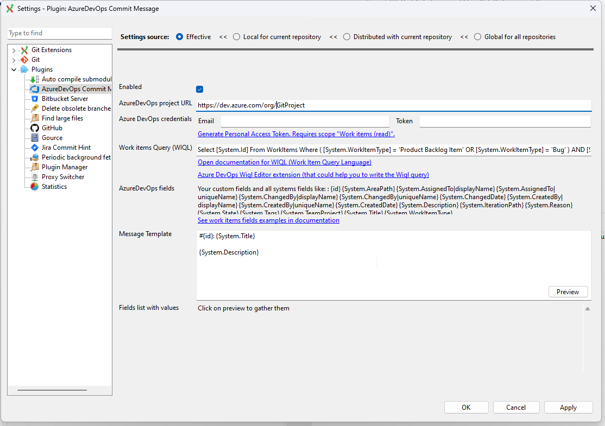
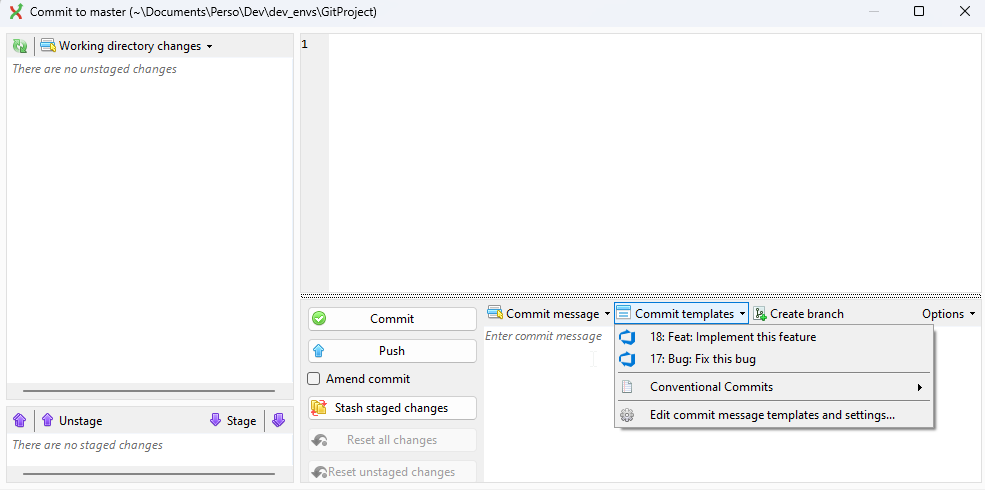

# GitExtensions AzureDevOpsCommitMessage Plugin
GitExtensions plugin to get template commit messages generated based on Azure Devops Work items inside [GitExtensions](https://github.com/gitextensions/gitextensions) commit form

**The default request generate templates for the PBIs and Bugs of the current sprint for the authenticated user.**

The package is going to be published on [NuGet.org](https://www.nuget.org/packages/GitExtensions.AzureDevOpsCommitMessage) feed.

## Versions

* v5.0 : Compatible with GitExtensions >= v5.0
* v2.0 : Compatible with GitExtensions < v5.0

## Configuration

1. Open AzureDevOpsCommitMessage plugin settings
2. Update settings:
    * Set ADO project  url
    * Set user e-mail
    * Generate and set an ADO Personal access token (with "Work items (read)" right).
3. Run the preview to check that it is working (no error occurred) and eventually that the WIQL query is doing what you expect
4. Apply settings

## Screenshots

* Settings:

* Commit messages:
